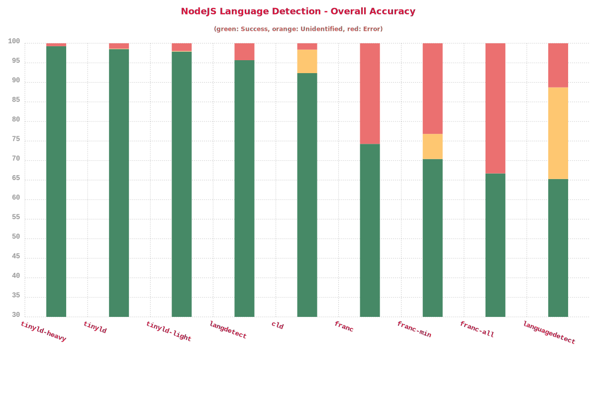

# Benchmark Language Detection Libraries

    > Benchmark done on tatoeba dataset (~9M sentences) on 16 of the most common languages.

### **Remark**

- Language evaluated in this benchmark:
  - Asia: `jpn`, `cmn`, `kor`, `hin`
  - Europe: `fra`, `spa`, `por`, `ita`, `nld`, `eng`, `deu`, `fin`, `rus`
  - Middle east: , `tur`, `heb`, `ara`
- This kind of benchmark is not perfect and % can vary over time, but it gives a good idea of overall performances

## Overall

| Library        | Script                      | Properly Identified | Improperly identified | Not identified | Avg Execution Time | Disk Size |
| -------------- | --------------------------- | ------------------- | --------------------- | -------------- | ------------------ | --------- |
| **TinyLD**     | `yarn bench:tinyld`         | 97.7311%            | 1.9247%               | 0.3441%        | 0.0966ms.          | 930KB     |
| **TinyLD Web** | `yarn bench:tinyld-light`   | 97.4512%            | 2.1131%               | 0.4358%        | 0.0802ms.          | **110KB** |
| **langdetect** | `yarn bench:langdetect`     | 94.879%             | 5.1093%               | 0.0117%        | 0.4631ms.          | 1.8MB     |
| node-cld       | `yarn bench:cld`            | 88.9148%            | 1.7489%               | 9.3363%        | 0.0477ms.          | > 10MB    |
| node-lingua    | `yarn bench:lingua`         | 86.3093%            | 0.13%                 | 13.5607%       | 1.5695ms.          | ~100MB    |
| franc          | `yarn bench:franc`          | 68.7783%            | 26.3432%              | 4.8785%        | 0.1626ms.          | 267KB     |
| franc-min      | `yarn bench:franc-min`      | 65.5163%            | 23.5794%              | 10.9044%       | 0.0734ms.          | **119KB** |
| franc-all      | `yarn bench:franc-all`      | 61.7893%            | 33.3322%              | 4.8785%        | 0.3688ms.          | 509KB     |
| languagedetect | `yarn bench:languagedetect` | 61.6068%            | 12.295%               | 26.0982%       | 0.212ms.           | **240KB** |

which gives us the following graph

## Per Language

Let's now compare those libraries per language

### **Conclusion**

#### Popular != Performant

- It's quite funny to notice the two most popular nodejs libs `languagedetect` (really high in google) and `franc` (over 4k stars on github) are both at the bottom of the charts.
- At the opposite `langdetect` which is quite unknown performs really well and is the only one to come close to `tinyld`.

#### Recommended

- For **NodeJS**: `TinyLD`, `langdetect` or `node-cld` (fast and accurate)
- For **Browser**: `TinyLD Light` or `franc-min` (small, decent accuracy, franc is less accurate but support more languages)

#### Not recommended

- `node-lingua` has a quite good accuracy but is just too big and slow
- `franc-all` is the worse in term of accuracy, not a surprise because it tries to detect 400+ languages with only 3-grams. A technical demo to put big numbers but useless for real usage, even a language like english barely reach ~45% detection rate.
- `languagedetect` is light but just not accurate enough, really focused on indo-european languages (support kazakh but not chinese, korean or japanese). Interesting fact, it's more accurate than franc on west european languages.
