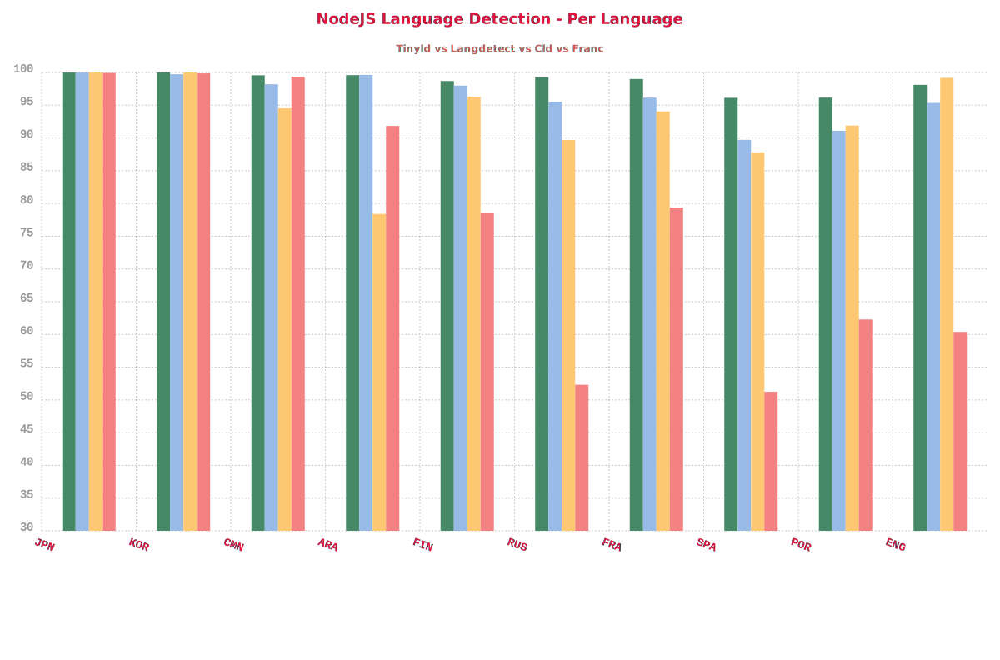
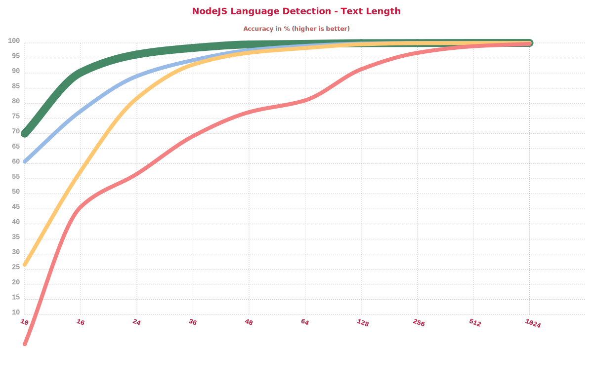
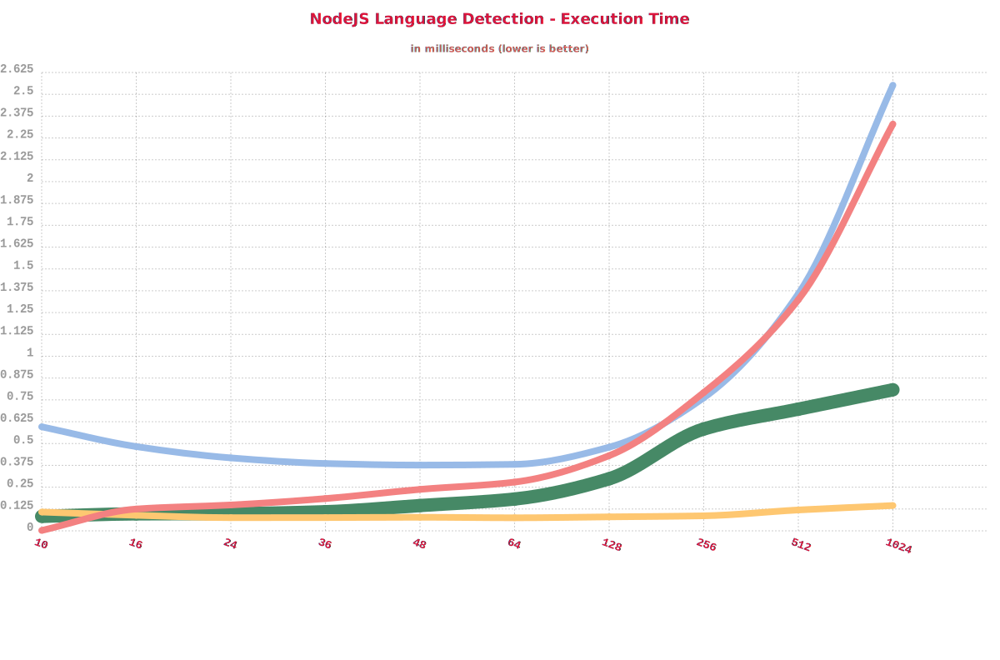

# NodeJS Language Detection Benchmark :rocket:

- This kind of benchmark is not perfect and % can vary over time, but it gives a good idea of overall performances
- Language evaluated in this benchmark:
  - Asia: `jpn`, `cmn`, `kor`, `hin`
  - Europe: `fra`, `spa`, `por`, `ita`, `nld`, `eng`, `deu`, `fin`, `rus`
  - Middle east: , `tur`, `heb`, `ara`
- This page and graphs are auto-generated from the code

---

## Libraries

Here is the list of libraries in this benchmark

| Library        | Script                      | Language | Properly Identified | Improperly identified | Not identified | Avg Execution Time | Disk Size |
| -------------- | --------------------------- | -------- | ------------------- | --------------------- | -------------- | ------------------ | --------- |
| **TinyLD**     | `yarn bench:tinyld`         | 64       | 98.252%             | 1.556%                | 0.1921%        | 0.066ms.           | 580KB     |
| **TinyLD Web** | `yarn bench:tinyld-light`   | 24       | 97.0769%            | 2.0718%               | 0.8513%        | 0.051ms.           | **68KB**  |
| **langdetect** | `yarn bench:langdetect`     | 53       | 95.6404%            | 4.3596%               | 0%             | 0.2874ms.          | 1.8MB     |
| node-cld       | `yarn bench:cld`            | 160      | 92.315%             | 1.6319%               | 6.0532%        | 0.0564ms.          | > 10MB    |
| franc          | `yarn bench:franc`          | 187      | 74.088%             | 25.912%               | 0%             | 0.151ms.           | 267KB     |
| franc-min      | `yarn bench:franc-min`      | 82       | 70.193%             | 23.3432%              | 6.4639%        | 0.0682ms.          | 119KB     |
| franc-all      | `yarn bench:franc-all`      | 403      | 66.4893%            | 33.5107%              | 0%             | 0.3486ms.          | 509KB     |
| languagedetect | `yarn bench:languagedetect` | 52       | 65.7081%            | 11.3484%              | 22.9435%       | 0.1808ms.          | 240KB     |

---

## Global Accuracy

We see two group of libraries

- `tinyld`, `langdetect` and `cld` over 90% accuracy
- `franc` and `languagedetect` under 75% accuracy

## Per Language

We see big differences between languages:

- **Japanese** or **Korean** are almost at 100% for every libs (lot of unique characters)
- **Spanish** and **Portuguese** are really close and cause more false-positive and an higher error-rate

## Accuracy By Text length

Most libraries are using statistical analysis, so longer is the input text, better will be the detection.
So we can often see quotes like this in those library documentations.

> Make sure to pass it big documents to get reliable results.

Let's see if this statement is true, and how those libraries behave for different input size (from small to long)

So the previous quote is right, over 512 characters all the libs become accurate enough.

But for a ~95% accuracy threshold:

- `tinyld` (green) reaches it around 24 characters
- `langdetect` (cyan) and `cld` (orange) reach it around 48 characters

## Execution Time

Here we can notice few things about performance:

- `langdetect` (cyan) and `franc` (pink) seems to slow down at a similar rate
- `tinyld` (green) slow down but at a really flat rate
- `cld` (orange) is definitely the fastest and doesn't show any apparent slow down

But we've seen previously that some of those libraries need more than 256 characters to be accurate.
It means they start to slow down at the same time they start to give decent results.

---

## **Conclusion**

### Recommended :thumbsup:

#### - By platform :computer:

- For **NodeJS**: `TinyLD`, `langdetect` or `node-cld` (fast and accurate)
- For **Browser**: `TinyLD Light` or `franc-min` (small, decent accuracy, franc is less accurate but support more languages)

#### - By usage :speech_balloon:

- Short text (chatbot, keywords, database, ...): `TinyLD` or `langdetect`
- Long text (documents, webpage): `node-cld` or `TinyLD`

### Not recommended :thumbsdown:

- `franc-all` is the worst in terms of accuracy, not a surprise because it tries to detect 400+ languages with only 3-grams. A technical demo to put big numbers but useless for real usage, even a language like english barely reaches ~45% detection rate.
- `languagedetect` is light but just not accurate enough

---

## Last word :raising_hand:

Thanks for reading this article, those metrics are really helpful for the development of `tinyld`.
It's used in the development to see the impact of every modification and features.

If you want to contribute or see another library in this benchmark, [open an issue](https://github.com/komodojp/tinyld/issues)
